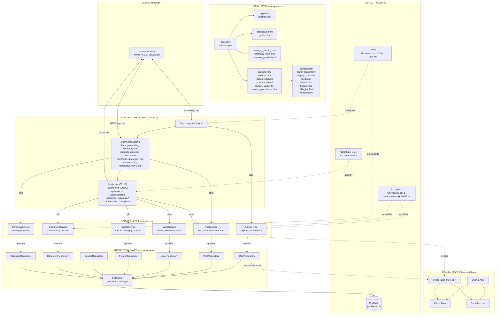
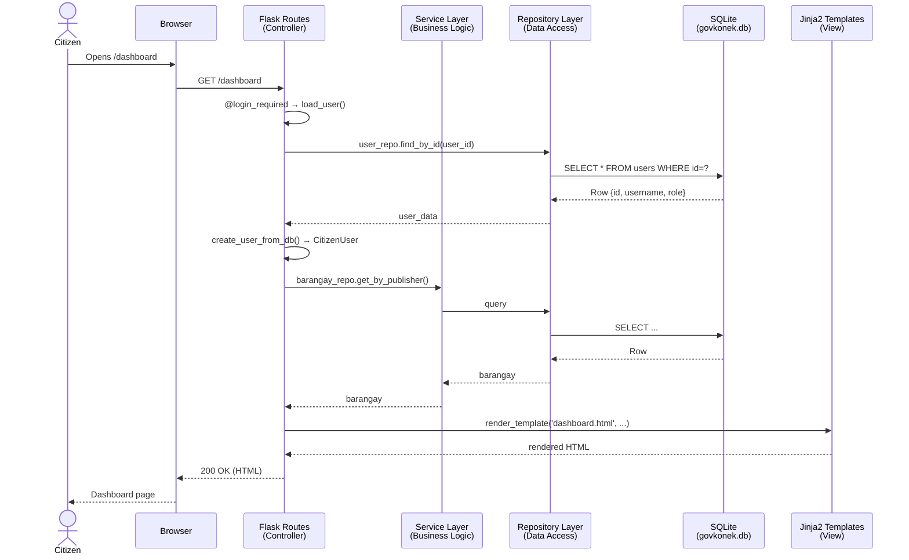
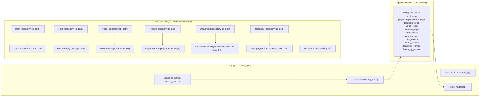

# GovKonek Flask Project — Architecture Diagrams

---

## 1. UML Class Diagram

```mermaid
classDiagram
    direction TB

    %% ────────────────────────────────────────────────────
    %% EXCEPTIONS
    %% ────────────────────────────────────────────────────
    class GovKonekError {
        +message: str
    }
    class DatabaseError {
        +original_error: Exception
    }
    class ConnectionError {
        +db_path: str
    }
    class RecordNotFoundError {
        +entity: str
        +identifier: str
    }
    class DuplicateRecordError {
        +entity: str
        +field: str
        +value: str
    }
    class AuthError
    class InvalidCredentialsError
    class RegistrationError
    class PermissionDeniedError
    class RequiredFieldError

    GovKonekError <|-- DatabaseError
    GovKonekError <|-- AuthError
    GovKonekError <|-- RequiredFieldError
    DatabaseError <|-- ConnectionError
    DatabaseError <|-- RecordNotFoundError
    DatabaseError <|-- DuplicateRecordError
    AuthError <|-- InvalidCredentialsError
    AuthError <|-- RegistrationError
    AuthError <|-- PermissionDeniedError

    %% ────────────────────────────────────────────────────
    %% CONFIG
    %% ────────────────────────────────────────────────────
    class Config {
        -_db_name: str
        -_secret_key: str
        -_login_view: str
        -_openweather_api_key: str
        -_upload_folder: str
        -_allowed_extensions: set
        +db_name: str (r)
        +secret_key: str (r)
        +login_view: str (r)
        +openweather_api_key: str (r)
        +upload_folder: str (r)
        +allowed_extensions: set (r)
    }

    %% ────────────────────────────────────────────────────
    %% DOMAIN MODELS  (models.py)
    %% ────────────────────────────────────────────────────
    class User {
        <<abstract>>
        -_id: int
        -_username: str
        -_role: str
        +id: int (r)
        +username: str (r)
        +role: str (r)
        +get_permissions()* list
        +can_publish()* bool
    }
    class CitizenUser {
        +get_permissions() list
        +can_publish() bool
    }
    class PublisherUser {
        +get_permissions() list
        +can_publish() bool
    }

    User <|-- CitizenUser : inherits
    User <|-- PublisherUser : inherits
    UserMixin <|-- User : inherits

    %% ────────────────────────────────────────────────────
    %% REPOSITORY LAYER  (repository.py)
    %% ────────────────────────────────────────────────────
    class DBContext {
        -_db_path: str
        -_connection: Connection
        +__enter__() Connection
        +__exit__() None
    }
    class BaseRepository {
        <<abstract>>
        -_db_path: str
        +_get_db() Connection
        +_execute(query, params, fetch, commit) any
        +_execute_write(query, params) cursor
    }
    class UserRepository {
        +find_by_id(user_id) Row
        +find_by_username(username) Row
        +create(username, hash, role) bool
    }
    class PostRepository {
        +get_all_posts(...) list
        +get_post_by_id(id) Row
        +create_post(...) dict
        +update_post(id, user_id, title, content) dict
        +delete_post(id, user_id) None
        +get_comments_for_post(id) list
        +add_comment(post_id, user_id, content) dict
        +get_reactions_for_post(id) list
        +toggle_reaction(post_id, user_id, emoji) tuple
        +get_user_reaction(post_id, user_id) str
        +get_posts_by_publisher(id) list
    }
    class ProjectRepository {
        +get_all() list
        +get_by_id(id) Row
        +get_by_publisher(id) list
        +create(...) dict
        +update(id, ...) dict
        +delete(id, user_id) None
    }
    class ServiceRepository {
        +get_all() list
    }
    class DocumentRepository {
        +get_all() list
        +create(filename, url) bool
    }
    class VoiceRepository {
        +get_all(...) list
        +get_by_id(id) dict
        +create(user_id, title, content, category) dict
        +delete(id, user_id) None
        +update_status(id, status) None
        +get_comments(id) list
        +add_comment(id, user_id, content, official) dict
        +toggle_vote(id, user_id, type) tuple
        +get_user_vote(id, user_id) str
    }
    class BarangayRepository {
        +get_all() list
        +get_by_id(id) Row
        +get_by_publisher(id) Row
        +get_first() Row
        +create(...) dict
        +update(id, ...) None
    }

    BaseRepository <|-- UserRepository
    BaseRepository <|-- PostRepository
    BaseRepository <|-- ProjectRepository
    BaseRepository <|-- ServiceRepository
    BaseRepository <|-- DocumentRepository
    BaseRepository <|-- VoiceRepository
    BaseRepository <|-- BarangayRepository

    %% ────────────────────────────────────────────────────
    %% SERVICE LAYER  (service.py)
    %% ────────────────────────────────────────────────────
    class BaseService {
        <<abstract>>
        +_require(value, field_name)$ void
        +_validate_choice(value, field, allowed)$ any
        +_check_publisher(user)$ void
        +_sanitize(value)$ str
    }
    class AuthService {
        -_user_repo: UserRepository
        +register_user(username, password, role) tuple
        +authenticate_user(username, password) tuple
    }
    class PostService {
        -_post_repo: PostRepository
        +get_feed(search, category, sort) list
        +get_post_detail(post_id, user_id) dict
        +add_comment(post_id, user_id, content) tuple
        +toggle_reaction(post_id, user_id, emoji) tuple
        +create_post(user, title, content, ...) tuple
        +update_post(user, post_id, title, content) tuple
        +delete_post(user, post_id) tuple
    }
    class VoiceService {
        -_repo: VoiceRepository
        +get_posts(...) list
        +get_post_detail(id, user_id) dict
        +create_post(user_id, title, content, category) tuple
        +update_status(id, status) tuple
        +delete_post(id, user_id) tuple
        +add_comment(id, user_id, content, role) tuple
        +toggle_vote(id, user_id, type) tuple
        +get_categories() list
    }
    class ProjectService {
        -_repo: ProjectRepository
        +create_project(user, ...) tuple
        +update_project(user, id, ...) tuple
        +delete_project(user, id) tuple
    }
    class DocumentService {
        -_repo: DocumentRepository
        -_config: Config
        +upload(...) tuple
        +get_all() list
    }
    class BarangayService {
        -_repo: BarangayRepository
        +get_by_publisher(id) Row
        +get_first() Row
        +get_by_id(id) Row
    }

    BaseService <|-- AuthService
    BaseService <|-- PostService
    BaseService <|-- VoiceService
    BaseService <|-- ProjectService
    BaseService <|-- DocumentService
    BaseService <|-- BarangayService

    %% ────────────────────────────────────────────────────
    %% UTILITIES
    %% ────────────────────────────────────────────────────
    class FileUploadHelper {
        -_upload_dir: str
        -_allowed_extensions: set
        +save(file, prefix, exts) str
        +delete(url_path) bool
    }

    %% ────────────────────────────────────────────────────
    %% RELATIONSHIPS: Service → Repository (injection)
    %% ────────────────────────────────────────────────────
    AuthService --> UserRepository : uses
    PostService --> PostRepository : uses
    VoiceService --> VoiceRepository : uses
    ProjectService --> ProjectRepository : uses
    DocumentService --> DocumentRepository : uses
    DocumentService --> Config : uses
    BarangayService --> BarangayRepository : uses

    %% ────────────────────────────────────────────────────
    %% FACTORY
    %% ────────────────────────────────────────────────────
    note for create_user_from_db "Factory Function: maps role → CitizenUser | PublisherUser"
```

---

## 2. MVC Architecture Diagram (Layered View)

---

## 3. Request Lifecycle (Sequence Diagram)

---

## 4. Dependency Injection Container

---

### Key Architectural Patterns

| Pattern | Where | Benefit |
|---------|-------|---------|
| **MVC** | routes → service → repository → templates | Separation of concerns |
| **Dependency Injection** | `app.py` → `_build_services()` | Testable, swappable implementations |
| **Repository Pattern** | `repository.py` (BaseRepository + 7 subclasses) | Isolates DB access, easy to swap SQLite for PostgreSQL |
| **Service Layer** | `service.py` (BaseService + 6 subclasses) | Business logic independent of HTTP |
| **Factory Pattern** | `create_user_from_db()` in `models.py` | Polymorphic User creation from DB rows |
| **Template Method** | `BaseRepository._execute()` / `BaseService` helpers | Shared behavior defined once |
| **Context Manager** | `DBContext` | Automatic connection cleanup |
| **OOP Pillars** | Encapsulation (private attrs + @property), Inheritance (Base* → subclasses), Polymorphism (CitizenUser vs PublisherUser), Abstraction (ABCs) | Maintainable, extensible codebase |
